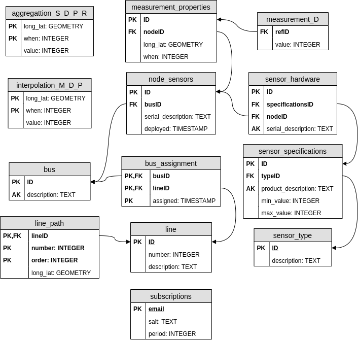

# ExpoLIS Server

This repository contains the sensor database, the html server, and the open service routing machine.  The source code in this repository is from the repositories expolis-database and expolis-routing-service.  The development and testining history is available in these two repositories.

# Requirements

    sudo apt install python3 python3-pip
    sudo apt install postgresql-13 postgis
    sudo apt install apache2
    sudo apt install php php-pgsql
    pip3 install python-daemon
    pip3 install posix-ipc
    pip3 install yaml
    pip3 install psutil
    pip3 install psycopg2-binary
    pip3 install paho-mqtt

Alternative to using `pip3 install`

    sudo apt install python3-daemon python3-yaml python3-posix-ipc python3-psutil python3-psycopg2

## Configuring Postgres

Two databases are created. One holds the sensor data, the other holds Open Street Map information. The sensor data
database is the main database in the ExpoLIS project.

Connection to the database depends on the goal. The ExpoLIS mobile app uses the role expolis_app that only has grants
to read the data. The role expolis_php is used by the apache server when processing HTML form submission.

Two files in the postgres server have to be modified. The file `pg_hba.conf` holds information of which roles and
databases can be connected. The file `postgresql.conf` has many configuration options. One of them is the host
addresses that it listen to connections. Depending on the installation used, the option `listen_addresses` may be set to
`localhost` or `*`.  Debian uses the former while Ubuntu the latter. The value `*` should be used in order to accept
connections from any host.

# Data Model

* table `interpolation_M_D_P` uses data stored in table `aggregation_avg_D_P_R`, with  is used by the mobile app to show

# Structure

Postgresql tables and functions used by the different cron and init scripts:

| dir  | script                 | table                      | function                                   |
|------|------------------------|----------------------------|--------------------------------------------|
| cron | aggregate_data_daily   |                            | aggregate_Statistic_Period_Resolution_Data |
| cron | aggregate_data_hourly  |                            | aggregate_Statistic_Period_Resolution_Data |
| cron | download_routing_data  |                            |                                            |
| cron | interpolate_data_daily | aggregation, interpolation |                                            |
| cron | update_routing_data    | interpolation              |                                            |
| init | mqtt_interface         | node_sensors               | insert_measurements                        |
| init | osrm_server            |                            |                                            |

Cron scripts

| period | script                          |
|--------|---------------------------------|
| hourly | aggregate_data_hourly           |
|        | manage_old_subscription_outputs |
|        | manage_subscriptions_hourly     |
| daily  | aggregate_data_daily            |
|        | manage_subscriptions_daily      |
|        | interpolate_data_daily          |
|        | update_routing_data             |
| weekly | download_routing_data           |

## Lua profiles 

| profile                         | folder                              | port  | pollution |
|---------------------------------|-------------------------------------|-------|-----------|
| normal-bicycle.lua              | profile-normal-bicycle              | 50101 | NA        |
| normal-car.lua                  | profile-normal-car                  | 50102 | NA        |
| normal-foot.lua                 | profile-normal-foot                 | 50103 | NA        |
| pollution-sensor-bicycle.lua    | profile-pollution-sensor-bicycle    | 50201 | sensor    |
| pollution-sensor-car.lua        | profile-pollution-sensor-car        | 50202 | sensor    |
| pollution-sensor-foot.lua       | profile-pollution-sensor-foot       | 50203 | sensor    |
| pollution-knowledge-bicycle.lua | profile-pollution-knowledge-bicycle | 50301 | knowledge |
| pollution-knowledge-car.lua     | profile-pollution-knowledge-car     | 50302 | knowledge |
| pollution-knowledge-foot.lua    | profile-pollution-knowledge-foot    | 50303 | knowledge |
